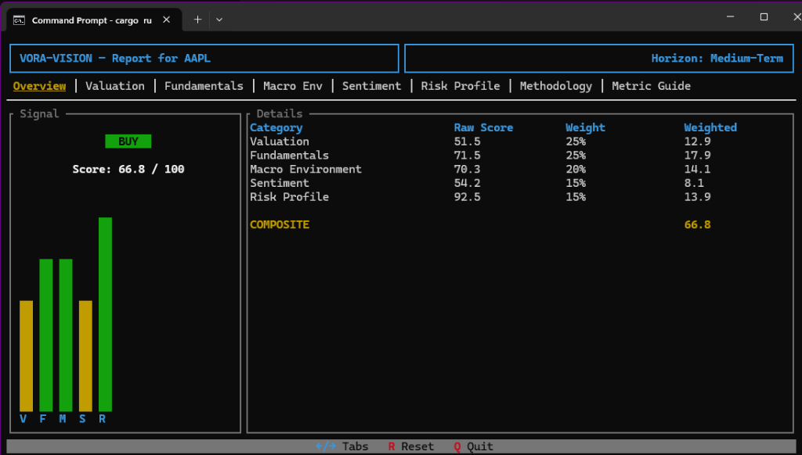

# VORA-Vision

```
 _    ______  ____  ___           
| |  / / __ \/ __ \/   |          
| | / / / / / /_/ / /| |          
| |/ / /_/ / _, _/ ___ |          
|___/\____/_/_|_/_/__|_|__  _   __
| |  / /  _/ ___//  _/ __ \/ | / /
| | / // / \__ \ / // / / /  |/ / 
| |/ // / ___/ // // /_/ / /|  /  
|___/___//____/___/\____/_/ |_/   
```

## Preview


*AAPL Overview on a Medium-Term horizon.*

**VORA-Vision** is an open-source TUI stock market analytics engine. It gathers market metrics from multiple financial APIs, normalizes them, and runs a context-aware scoring algorithm using weighted scores according to the user's preferred investment timeframe (Short-Term, Medium-Term, or Long-Term).

## Setup & API Keys

Configure your credentials in a `.env` file in the root directory:

```env
FINNHUB_API_KEY=your_finnhub_key_here
FRED_API_KEY=your_fred_key_here
SEC_EDGAR_USER_AGENT=YourName name@domain.com
```

* **Finnhub Key:** Get it free at [finnhub.io](https://finnhub.io/)
* **FRED Key:** Get it free at [fred.stlouisfed.org](https://fred.stlouisfed.org/)
* **SEC User Agent:** Any email address (required by the SEC API)

## Running from Source

Requires the Rust toolchain ([rustup.rs](https://rustup.rs/)).

```bash
git clone https://github.com/sam-cre/VORA-Vision.git
cd VORA-Vision
cargo run
```

## Build Installer (Windows)

Requires [NSIS](https://nsis.sourceforge.io/).

```powershell
cargo build --release
makensis installer.nsi
```
This outputs `VORA-Vision-Installer.exe`.

## License & Disclaimer

* **License:** MIT License (see [LICENSE](LICENSE)).
* **Disclaimer:** Not financial advice. VORA-Vision is for educational and analytics purposes only. Sam Rogers is not liable for any financial decisions.
